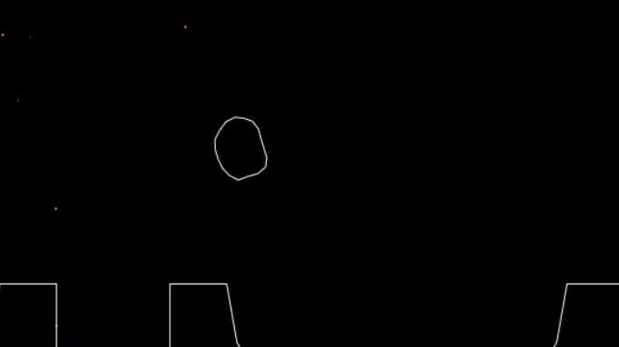
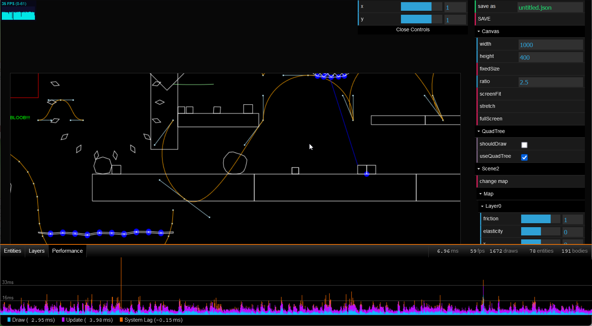
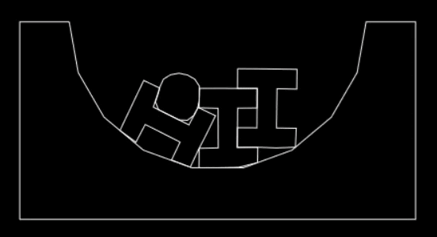

bloob
=====

Bloob is a soft-body physics engine written in JavaScript.

[Try it live!](https://onsetsu.github.io/bloob/bloob.html)

## Features

Bloob features multiple body types, including pressure- and spring-based bodies.
We further support many types of joint and forces.
Objects can be created and manipulated at runtime.

## Debugging Tools

We include visual debugging tools that can be adapted to the current debugging task.

